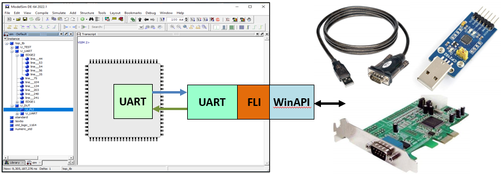
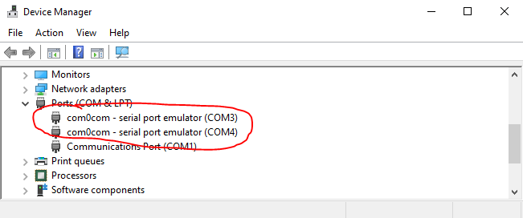
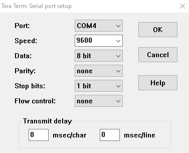
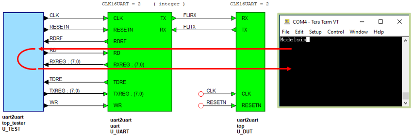
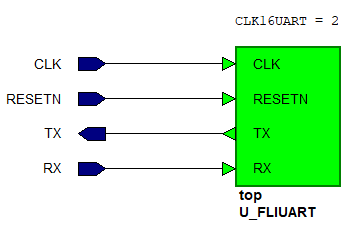
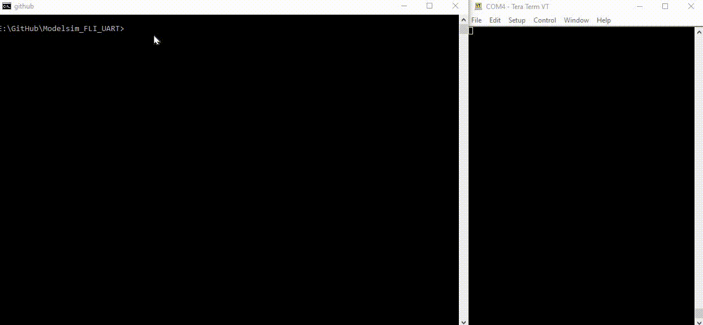

# Modelsim_FLI_UART



There are occasions where it is easier to connect a running simulation to a real hardware serial port. Examples are PC application such as bootstrap loaders, serial monitor/controllers, GUI etc connected to a simulated Processor+UART. Duplicating those processes in a testbench is time consuming.

This repository shows an example how one can connect a running simulation to a real serial port via the **Foreign Language Interface** (FLI).

The design consist of a standard VHDL UART connected via a thin FLI layer to the Windows10 serial port WinAPI. The FLI layer acts as a very simple processor which transfer characters between the VHDL UART and the WinAPI. As the WinAPI can receive characters much faster than simulation can handle the receiving side has a small receive buffer. 

To talk to another local serial application like a terminal ([Teraterm](https://ttssh2.osdn.jp/index.html.en), [Putty](https://www.chiark.greenend.org.uk/~sgtatham/putty/), Realterm, etc..) the [com0com](https://sourceforge.net/projects/com0com/) null modem can be used. This excellent utility provides two back to back virtual UARTs. Any data written to one of the virtual UART's is copied to the second one and vice versa. Both back to back UART's appear as real serial ports in the Windows device manager. 



## How fast is it?

The first question that might come up is how fast is it? This is difficult to answer as the speed is determined solely by the RTL simulation speed. In this example **9600bps** was no problem for the testbench that simply echo's characters back to the sender. To improve the communication speed no signals where logged *(nolog -r \*)* and Modelsim's batch mode was used.

However, **the interface can loose characters** if the (receiving) character rate is to high. In this case Modelsim can't keep up processing the data and characters will be lost. The number of lost characters can be alleviated by either increasing the receive buffer size or adding a small delay between transmission, most terminal programs have options to specify a **"Transmit delay"**, see Teraterm's option below. 




## Requirements
1) 64bits Modelsim DE (or Questa), Modelsim PE users need to install 64bits Modelsim DE *(works on a PE license)*
2) 64bits gcc-7.4.0-mingw64vc15 as supplied with Modelsim 2022.2 *(other versions and Visual C++ will also work)*
3) [com0com](https://sourceforge.net/projects/com0com/) Null-Modem emulator.
4) Serial terminal such as [Teraterm](https://ttssh2.osdn.jp/index.html.en), [Putty](https://www.chiark.greenend.org.uk/~sgtatham/putty/)

## Check before building
1) Make sure the Modelsim installation root directory is set via the **MTI_HOME** environmental variable. This is required because the **run.bat** file uses %MTI_HOME%/include and %MTI_HOME%/win64pe.
```
E:\Modelsim_FLI_UART>echo %MTI_HOME%
D:\Products\modelsim_de_2022
```

2) Make sure the Modelsim gcc bin directory (*\<modelsim_install_directory\>\gcc-7.4.0-mingw64vc15\bin*) is in the search path.
```
E:\Modelsim_FLI_UART>gcc --version
gcc (GCC) 7.4.0
Copyright (C) 2017 Free Software Foundation, Inc.
This is free software; see the source for copying conditions.  There is NO
warranty; not even for MERCHANTABILITY or FITNESS FOR A PARTICULAR PURPOSE.
```

3) Test the com0com utility by connecting 2 terminals, check that characters can be transferred between the 2 serial ports.


## How does the demo work?

The design consist of a simple testbench with an instantiated VHDL UART (U_UART). The UART is connected to the **"FLI UART"** (U_DUT) which in turn talks to the WinAPI (U_DUT). The WinAPI talks to a serial terminal like Teraterm. Any characters send from Teraterm are echoed back by the testbench (U_TEST). If the '@' character is received the simulation will stop.




To add the FLI UART to a new design you need the rtl/\*.vhd files and the uart_fli.dll. Next connect the **RX** and **TX** pins, the **RESETN** to an active low reset signal and **CLK** to a 16\*BAUDRATE\*CLK16UART clock. In the example we use 9600bps and a divide by 2 divider (CLK16UART=2) so the required clock is 307.2KHz.



## Build FLI DLL and run the demo
Before building the example open the src/uart_fli.h and check the comport settings.

```C
#define RXBUFFER    32                  // Buffer bytes received from "real" comport	
#define COMPORT     "\\\\.\\COM3"       // One of the com0com ports
#define BAUDRATE    9600 			
```

If all OK open a CMD prompt and execute **run.bat**. This should produce **uart_fli.dll** and start the Modelsim simulation. 

Next open the serial terminal, set the baudrate and serial port (to the other com0com port) and disable the local echo (so you can see the echoed characters). 

Any characters typed into the Terminal should be echo'd back as shown below.



## Miscellaneous
The Modelsim/Questa batch mode (vsim -batch, no GUI) gives the fastest simulation performance, however, for some reason the command line mode (vsim -c, no GUI) was slower on my setup than running the demo in the GUI.

An overrun detection can be added in hardware if required. A possible solution would be to combine the receiving VHDL UART's RDRF (Receive Data Register Full) signal together with a buffer full signal (bufptr==RXBUFFER) and detecting new receive characters pending (src\comport.c poll_comport())

## License

See the LICENSE file for details.

## Notice
ModelSim®, Questa, QuestaSim and their respective logos are trademarks or registered trademarks of Siemens Industry Software Limited.


